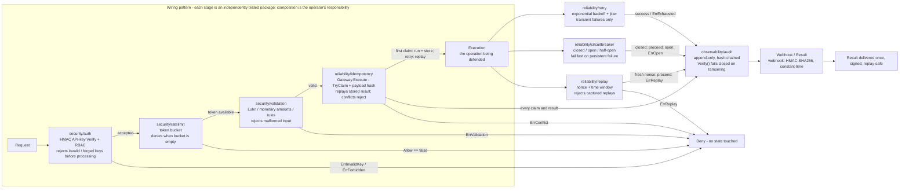

# Architecture

Each package owns one failure mode. There are no cross-package imports between
concerns, so each can be reasoned about and tested in isolation.

## Idempotency flow

```
request (key, payload)
  → hash payload (sha256)
  → TryClaim(key, hash)
      ├─ already claimed, different payload → 409 conflict
      ├─ already claimed, completed        → return stored response
      └─ new key                            → run op, MarkComplete, return
```

Key semantics: one logical operation = one key; the *payload hash* prevents a
key being silently reused for a different request.

## Circuit breaker state machine

```
CLOSED --failure>=threshold--> OPEN
OPEN   --cooldown elapsed-->   HALF-OPEN
HALF-OPEN --probe success>=n--> CLOSED
HALF-OPEN --probe failure-->    OPEN
```

## Audit chain

```
entry N = {seq, timestamp, actor, action, resource, prev_hash=hash(N-1), hash=hash(N)}
Verify() recomputes every hash and re-links prev_hash; any mutation breaks the chain.
```

## Diagram

Source: [diagrams/production-systems.mmd](diagrams/production-systems.mmd)
(rendered inline for GitHub; edit the `.mmd`, regenerate with `mmdc`).



## Evidence map (diagram -> code)

Each stage maps to `docs/failure-matrix.md`, where the same package carries its
control and the unit test that proves it.

| Stage | Package | Failure it defends | Evidence |
| --- | --- | --- | --- |
| Auth / HMAC | `security/auth` | forged or stolen keys | `TestVerifyRejectsTamperedKey`, `TestVerifyRejectsWrongSecret` |
| Rate limit | `security/ratelimit` | abuse and burst overload | `TestAllowConsumesTokens`, `TestRefill` |
| Validation | `security/validation` | malformed input corrupting state | `validation_test.go` |
| Idempotency | `reliability/idempotency` | duplicate request double-settlement | `TestExecuteRetryReturnsStoredResult`, `TestExecuteSameKeyDifferentPayloadConflicts` |
| Retry | `reliability/retry` | transient dependency failure | `TestRetryRetriesUntilSuccess`, `TestRetryExhausts` |
| Circuit breaker | `reliability/circuitbreaker` | persistent dependency failure | `TestOpensAfterThreshold`, `TestHalfOpenProbeSucceedsCloses` |
| Replay protection | `reliability/replay` | captured request re-sent later | `TestValidateRejectsDuplicateNonce`, `TestValidateRejectsExpired` |
| Audit chain | `observability/audit` | tampered trails | `TestTamperDetected`, `TestChainLinks` |
| Webhook | `webhook` | forged or replayed deliveries | `TestVerifyRejectsTamperedPayload`, `TestSignVerifyRoundTrip` |

## See also
- `docs/failure-matrix.md` — every failure mode mapped to its control and test
- `docs/methodology.md`
